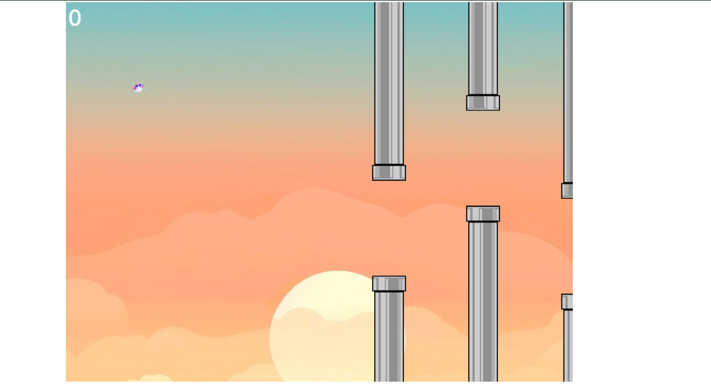
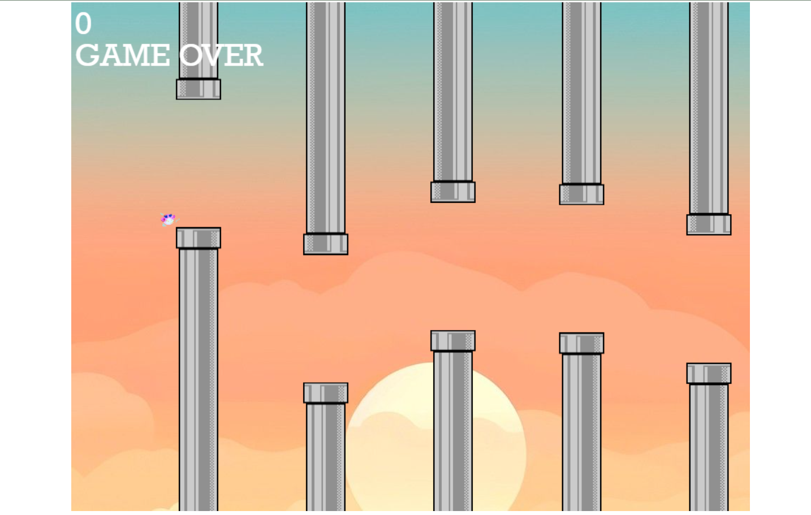

# Go Go Birds

Go Go Birds is a fun and addictive game inspired by the classic Flip Flap game. The goal is to guide the bird through the pipes and gain score.

## How to Play

- Use the spacebar to make the bird jump.
- Avoid the pipes.

## Features

- Simple and intuitive controls.
- Increasing difficulty as you progress.

## Screenshots

## Try it Out

Play the game [here](https://sithumsankajith.github.io/Go-Go-Birdy/).

## Contributing

Contributions are welcome! If you have any suggestions or improvements, feel free to open an issue or create a pull request.

## License

This project is licensed under the MIT License - see the [LICENSE](LICENSE) file for details.
